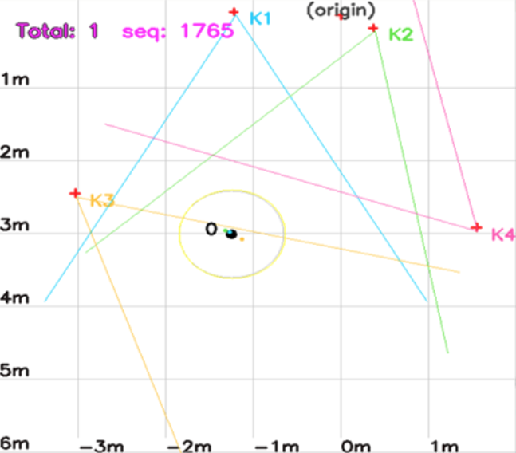

sHRI-Lab : Sensor Network In-Motion Perception In-Clouds 
===========================================================

# sp_hd_fs 모듈 설치 및 운용 가이드

## 1. Description

복수개의 PSN_UNIT을 통해 인식한 위치 및 ROI 정보를 위치에 기반하여 융합을 수행하는 모듈


  ​

#### 구성요소 - Software

- sp_hd_fs : 4대의 psn_unit에서 인식된 정보를 하나로 합침과 동시에 추적(Tracking)을 수행하는 모듈(ROS 환경에서 동작한다.)
- kr_tracker : sp_hd_fs 모듈에서 트래킹을 위한 함수를 제공하는 클래스
- sp_hd_gather : 4대의 psn_unit으로 부터의 인식 정보를 합쳐서 하나의 토픽(Topic)으로 발행한다.
- sp_hd_calibration : sp_hd_fs의 원활한 동작을 위해 psn_unit의 위치정보를 자동으로 찾아주는 모듈


## 1. Getting Started

### 1.1 Requirements

- 파이썬 의존 패키지 설치 : munkres scipy sklearn numpy PyKDL matplotlib
    ```
    sudo pip install -r requirements.txt

    ``` 


## 3. Usage

### 모듈 동작 확인
sp_hd_fs 패키지의 모듈들은 아래의 순서로 실행해야 한다.

0. ROS parameter 설정
    ```
    source $simonpic_recognition_ROOT/cfg/setEnvParam.sh

    ```
    
    

1. sp_hd_gather 모듈 실행
    ```
    rosrun sp_hd_fs sp_hd_gather.py

    ```
    ※ 에러 발생시 각 psn_unit의 출력 토픽(/sn_kinect/detector#) 확인 후 재실행
    
    
    
2. sp_hd_calibration 모듈 실행(카메라 재정렬이 필요시 수행)

   실제 실험 환경에서의 기준 카메라(psn_unit1)의 위치를 고정 시킨 후 모듈 실행
   
   ```
   rosrun sp_hd_fs sp_hd_calibration.py
   
   ```
   모듈 종료 확인 후
   ```
   rosparam get /psn_unit#
   ```
   으로 각 unit의 위치 및 방향각 파라미터를 얻은 후  
   $simonpic_recognition_ROOT/cfg/setEnvParam.sh
   파일을 수정해준다.
   
   
    
   
3. sp_hd_fs 모듈 실행 

   ```
   rosrun sp_hd_fs sp_hd_fs.py 
   ```
   동작 확인
   
   
   1) 모듈 실행시 팝업되는 GUI에서 각 카메라(K1, K2, K3, K4)의 위치와 방향각이 자동 켈리브레이션을 통해 잘 찾아졌는지 확인 한다.
   
   2) 사람이 인식되었을때 각 카메라에서의 입력이 화면에 표시 되는지(작은 생상 점)와 정보 융합을 통해 merge 되었는지(검은 큰 점)을 확인 하고 사람이 움직였을때 잘 추적하는지 확인한다.
   
   ※ sp_hd_rcnn 모듈의 human_filter 가 적용된 데이터를 이용하려면 다음을 통해 파라미터를 변경한다.
   ```
   rosparam set /FP_filter True

   ```
   

## 4. Etc..
